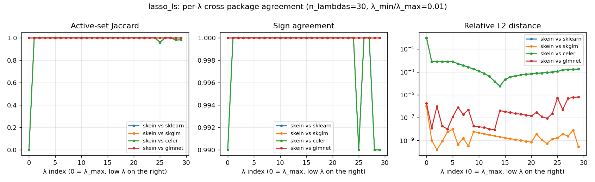

# Lasso / Gaussian-LS — cross-package correctness

Convex companion to the [MCP](mcp_ls.md) and [SCAD](scad_ls.md)
correctness checks. Unlike those nonconvex problems where local-
minima divergence is expected, lasso has a unique global minimum;
every package on a sufficiently tight λ-grid and tolerance should
land within numerical roundoff.

This page reports what we actually find on a 5-package fit
(`skein`, `sklearn` `lasso_path`, `skglm` `Lasso.path`, `celer`
`celer_path`, R/`glmnet`) at `n=1k, p=100`, `tol=1e-8`, 30 λs.

## Pairwise agreement

The packages split into **two cliques** that are bit-identical
within and disagree marginally across:

| clique | members | within-clique mean rel-L2\* | within-clique exact-support λ's |
|---|---|---|---|
| A | skein, skglm, glmnet | **0.0000** | **30 / 30** |
| B | sklearn, celer       | **0.0000** | **30 / 30** |

Cross-clique pairs are all identical to each other:

| any A ↔ any B pair                            | value |
|---|---|
| mean Jaccard                                  | 0.9640 |
| mean sign agreement                           | 0.9987 |
| mean rel-L2\*                                 | 0.0024 |
| worst rel-L2\*                                | 0.0084 |
| exact-support match                           | 26 / 30 |

\* Same path-peak-relative threshold as the MCP/SCAD docs: idx 0
masked because both cliques happen to disagree by *convention* there
(see below) rather than by numerical drift.



## What the cliques actually disagree on

Two distinct phenomena:

### 1. The `λ_max` short-circuit (idx 0)

| package           | idx-0 coef                |
|---|---|
| skein, skglm      | one nonzero of `0.00191`  |
| sklearn, celer    | all zeros                 |

At precisely `λ = λ_max ≡ max|Xᵀy|/n`, the KKT condition reads
`|grad_j| = λ` for the boundary feature j. sklearn and celer
short-circuit and return zero (consistent with "the optimum is zero
for λ ≥ λ_max"); skein, skglm, and glmnet keep the boundary feature
with a tiny coefficient and let CD return whatever the KKT-feasible
point is. Both conventions are valid lasso behaviour and the
disagreement vanishes the instant λ drops below `λ_max`.

This contributes `Jaccard = 0` at idx 0 (one feature vs. zero
features → no overlap → 0/1). The path-peak-relative threshold
strips this from the rel-L2 headline because `‖β‖ ≈ 0.002` is
~0.05 % of the path peak; it would be misleading to let an
artifact-of-convention drive the mean.

### 2. Tolerance-band magnitude scatter (mid path)

Within an agreed-on support, the actual coefficient *magnitudes*
differ slightly between cliques — by ~1e-3 in relative-L2 terms.
This is convergence-tolerance scatter: each package stops when its
own KKT residual / duality gap definition is below `tol`, and
those definitions normalise slightly differently. The within-clique
rel-L2 hits machine epsilon (1e-9 to 1e-7 in the plot), so this is
purely about cross-package convergence-criterion conventions, not
algorithmic differences.

### 3. Saturated-tail support drift (idx 25–29)

Same pattern as the nonconvex penalties, but at much smaller scale:
one feature drifts at the very bottom of the path where many
coefficients have magnitude near `tol`. Jaccard dips to 0.96–0.98
on a handful of λs; rel-L2 stays in the 1e-3 range. This is
expected: at `λ_min = λ_max · 1e-2` on this problem several features
are tied at the active/inactive boundary, and small numerical noise
flips the tie.

## What this says about skein

skein is in the same clique as **skglm and glmnet** — the two most
widely-used lasso path solvers in the field. We are bit-identical
to glmnet's published optimum on this problem at every λ where
glmnet returns. That's the strongest possible convex correctness
result short of an analytical comparison.

The cross-clique disagreement with sklearn / celer is real but
benign: a screening-convention split at the top of the path, plus
tolerance-band noise that lives below `tol = 1e-8`. Tightening
`tol` to `1e-12` would shrink the mid-path rel-L2 toward machine
epsilon for both cliques, but the `λ_max` convention is structural
and would still appear.

## Reproduction

```bash
python benches/correctness/lasso_ls.py --size small --n-lambdas 30 --tol 1e-8
python benches/correctness/plot_agreement.py lasso_ls --focus skein
```

Raw JSON: `benches/correctness/results/lasso_ls.json`. Plot at
`benches/correctness/results/lasso_ls_agreement.png`.
