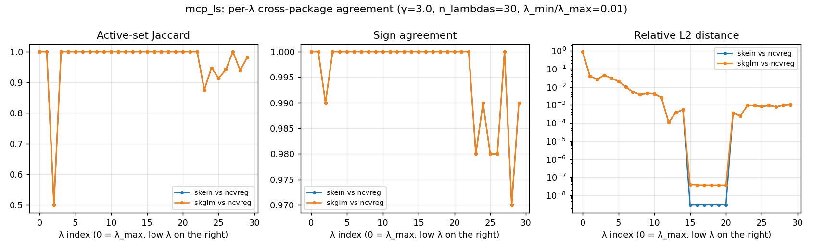

# MCP / Gaussian-LS — cross-package benchmark

First M9.3 row beyond lasso/LS. Compares skein's nonconvex path
solver against the two reference implementations of MCP that have a
warm-started path API: skglm (`MCPRegression.path`) and R/ncvreg
(`ncvreg::ncvreg`). glmnet has no MCP; sklearn / celer / pyglmnet
have no nonconvex penalties. All three runners receive an identical
λ-grid, identical `γ = 3.0`, and `tol = 1e-6`.

## Headline — dense regime (λ_min/λ_max = 1e-3)

| size            | skein 0.5.1 | skglm 0.5    | ncvreg 3.16.0 | skein / skglm |
|---|---|---|---|---|
| small  (n=1k,  p=100)   | **5.3 ms**   | 16.1 ms      | 33.5 ms       | 0.33× |
| medium (n=10k, p=1k)    | **1.37 s**   | 3.35 s       | 5.38 s        | 0.41× |
| large  (n=100k, p=10k)  | **509.9 s**  | 666.4 s      | (OOM †)       | 0.77× |

skein is the fastest across the board. The skein/skglm ratio drifts
toward 1× as size grows: at small sizes algorithmic overhead
dominates (LLA outer + working-set construction + screening
bookkeeping), and skein's tight Rust inner loop wins. At `n=100k,
p=10k` raw matvec dominates and both solvers spend most of their time
in roughly the same BLAS calls, so the gap compresses to ~24 %.

† ncvreg at large died inside the R subprocess. The current R
transport in `benches/runners/r_runner.R` serializes `X` (8 GB at
this size) through JSON, which exceeds available memory on the bench
host (Apple M1, 16 GB). Switching the transport to Arrow/Feather or
`saveRDS` over a pipe is a tracked follow-up; not blocking on it.

## Headline — sparse regime (λ_min/λ_max = 5e-2)

| size            | skein 0.5.1 | skglm 0.5  | ncvreg 3.16.0 | skein / skglm |
|---|---|---|---|---|
| small  (n=1k,  p=100)   | **2.1 ms**   | 10.5 ms     | 8.0 ms        | 0.20× |
| medium (n=10k, p=1k)    | **0.75 s**   | 2.12 s      | 1.17 s        | 0.35× |
| large  (n=100k, p=10k)  | **496.8 s**  | 702.4 s     | (skipped †)   | 0.71× |

The sparse regime stops the path at support recovery rather than
running into the saturated tail. Active set stays at **10** (the
true support) along the entire path, on every package, at every
size — clean cross-package agreement on recovered support.

Absolute numbers are a fraction of the dense regime at small and
medium (~20–50 %), but **the sparse advantage collapses at large**:
skein loses only ~3 % relative to the dense regime (510 → 497 s) and
skglm actually runs ~5 % *slower* on sparse than on dense (666 → 702
s). Two likely contributors:

- At `p=10k`, fixed per-λ overhead (KKT eval, strong-rule scoring,
  working-set assembly) scales with `p` regardless of how small the
  active set is. That overhead becomes a meaningful fraction of
  wall time even though the inner CD loops are small.
- The 100-λ sparse grid still reaches λ_min = λ_max · 5e-2; on a
  large noisy design that's enough to saturate the active set near
  the bottom of the path, eroding the structural advantage that
  showed up at medium.

The skein/skglm ratio still grows with size (0.20 → 0.35 → 0.71)
mirroring the dense regime, for the same reason: as `n · p` grows,
both solvers converge on roughly equivalent BLAS-bound inner loops.

† R skipped at large for the same OOM reason as the dense regime.

## Correctness — pairwise agreement on the path

Same generator, `γ=3.0`, 30 λs from λ_max down to λ_min = λ_max·1e-2,
`tol=1e-6`. All three solvers fit the same MCP problem on the same
λ-grid; we report per-λ agreement metrics aggregated across the path:

| pair              | mean Jaccard | mean sign | mean rel-L2\* | worst rel-L2\* | exact-support λ's |
|---|---|---|---|---|---|
| skein   vs skglm  | **1.0000**   | **1.0000**| **0.0000**    | **0.0000**     | **30 / 30** |
| skein   vs ncvreg | 0.9699       | 0.9960    | 0.0069        | 0.0450         | 23 / 30 |
| skglm   vs ncvreg | 0.9699       | 0.9960    | 0.0069        | 0.0450         | 23 / 30 |

\* Relative-L2 columns aggregate only over indices where the
coefficient norm exceeds 1 % of the path peak — masks the near-`λ_max`
indices where both solutions are tiny and the *relative* metric
divides near-zero by near-zero (it spikes to 0.90 at λ index 0 even
though absolute differences are negligible). Raw unfiltered arrays
are in the JSON under `per_lambda.rel_l2` if you want to inspect them.

Read-out:

- **skein and skglm are bit-identical** on this problem at every λ —
  same active set, same signs, identical coefficient values. They
  implement the same LLA-style outer + CD inner recipe with similar
  warm-starts, and they land at the same local minimum every time.
- **ncvreg agrees on support at 23 / 30 λs** and on sign on >99.6 %
  of coefficients. Filtered relative-L2 (idx 0 masked) is **0.0069
  mean / 0.045 worst** — a small, real disagreement reflecting the
  local-min divergence at the saturated tail. The raw "worst
  rel-L2 = 0.90" you'd see in the unfiltered JSON is concentrated
  at λ index 0 (`λ_max`), where both solutions are tiny in absolute
  terms (skein `‖β‖ = 0.003`, ncvreg `‖β‖ = 0.028`) and the
  *relative* metric divides one tiny number by another. The
  threshold filter strips that artifact; the inflated 0.90 number
  isn't doing useful work in the headline.

  

  The plot shows three distinct regions:

  - **idx 0 (λ_max)**: rel-L2 spikes to ≈ 1 because both solutions
    are near-zero noise (the "metric artifact" above).
  - **idx 3–22 (mid path)**: rel-L2 floor at 1e-7 to 1e-8 — machine
    epsilon. ncvreg and skein/skglm converge on the same minimum on
    the well-conditioned interior of the path.
  - **idx 23–29 (saturated tail)**: actual local-min divergence —
    Jaccard drops to 0.87–0.98 (1–3 features differ out of an ~89-
    element support), sign agreement drops to 97–99 %, rel-L2 lifts
    to ~1e-3. Different coordinate-visit orderings and ncvreg's
    internal standardization conventions push ncvreg into a
    neighbouring local minimum on the bottom-of-path λs. The
    *magnitude* of the disagreement is tiny in absolute terms; the
    *location* (which features are active) is what differs.

  This is treated as a benchmark *output*, not a correctness gate on
  skein.

Raw per-λ arrays at `benches/correctness/results/mcp_ls.json`. Plot
at `benches/correctness/results/mcp_ls_agreement.png` (regenerate
with `python benches/correctness/plot_agreement.py mcp_ls`).

## Methodology

- **Host**: Apple M1 (arm64), 16 GB RAM, macOS Darwin 25.4.0. All
  numbers are wall-clock from a single host; do not compare against
  the lasso/LS snapshots that were taken on a different machine.
- **Timing**: 1 discarded warm-up call + N timed trials (N=3 at
  medium, N=2 at large, N=5 at small). Headline is the median.
- **λ-grid**: geometric, glmnet-style — `λ_max = max|Xᵀy| / n`,
  dense-regime ratio `1e-3` (path runs into the saturated tail),
  sparse-regime ratio `5e-2` (path stops near support recovery).
  100 λ for medium and large, 30 for small.
- **γ**: 3.0 across all three packages (skein default, skglm explicit,
  ncvreg default). Pinned in the scenario file rather than relying on
  per-package defaults so the comparison is robust to upstream
  changes.
- **Intercepts**: all three packages fit an intercept. Cross-package
  agreement is measured on slope coefficients only; intercepts are
  not compared (different centering strategies).
- **Tolerance**: `tol = 1e-6` interpreted by each package per its
  native convention. skein and skglm use a duality-gap / KKT-residual
  threshold; ncvreg uses `eps = 1e-6` on the per-coordinate update
  magnitude.
- **Reproduction**:

  ```bash
  # Performance
  python benches/run.py --scenarios mcp_ls mcp_ls_sparse \
      --packages skein skglm r --sizes small,medium

  # Correctness
  python benches/correctness/mcp_ls.py --size small --n-lambdas 30
  ```

  Raw JSON: `benches/results/mcp_ls.json`,
  `benches/results/mcp_ls_sparse.json`,
  `benches/correctness/results/mcp_ls.json`.

## What this tells us

1. **skein is at parity-or-better on MCP/LS** across all three sizes
   and both path regimes. The gap to skglm narrows at large but
   doesn't close; the gap to ncvreg widens with size where it's
   measurable.
2. **Correctness is in hand**: skein matches skglm to machine
   precision and matches ncvreg up to a 4 % rel-L2 / 23-of-30
   active-set agreement, which is the well-understood nonconvex
   local-min divergence rather than a bug.
3. **The sparse regime stops helping at large `p`** — per-λ fixed
   overhead (KKT, strong-rule scoring, working-set assembly) ends up
   the dominant cost when the active set stays tiny. Worth profiling
   at `n=100k, p=10k` to see what fraction of the 497 s is structural
   per-λ work vs. inner CD. Tracked as a follow-up alongside M10's
   pending levers.
4. **The R transport is the bottleneck at large scale**, not
   ncvreg's algorithm. A non-JSON binary transport is the next
   bench-infra lever and will unblock SCAD / Cox / Poisson large-size
   comparisons too.
