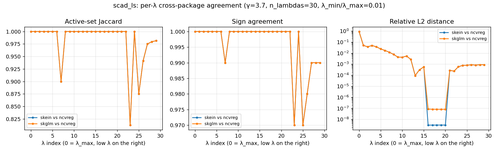

# SCAD / Gaussian-LS — cross-package benchmark

Second M9.3 nonconvex row. SCAD is MCP's older cousin — same flavour
of nonconvex penalty (quadratic spline, unbiased on truly large
coefficients) but a different shape and a conventional `γ = 3.7`
instead of 3.0. Comparators are skein, skglm, and R/ncvreg.

skglm ships the `SCAD` penalty class but no estimator wrapper or
`.path()` method, so the runner manually assembles a warm-started
α-loop through `GeneralizedLinearEstimator(SCAD, Quadratic,
AndersonCD)`. Across runs the prior `coef_` is preserved by the
solver's `warm_start=True`, matching the shape of skglm's built-in
`MCPRegression.path` / `Lasso.path`. Comparison stays apples-to-
apples.

## Headline — dense regime (λ_min/λ_max = 1e-3)

| size            | skein 0.5.1 | skglm 0.5    | ncvreg 3.16.0 | skein / skglm |
|---|---|---|---|---|
| small  (n=1k,  p=100)   | **7.0 ms**   | 41.0 ms      | 51.0 ms       | 0.17× |
| medium (n=10k, p=1k)    | **1.78 s**   | 9.47 s       | 7.99 s        | 0.19× |
| large  (n=100k, p=10k)  | **538.7 s**  | 11 307.6 s   | (skipped †)   | **0.048×** |

skein is the fastest across the board. The skein/skglm gap is
*wider* on SCAD than on MCP at every size (0.19× vs 0.41× at
medium): skglm's MCP estimator has an internal optimized `.path()`
that pre-allocates and reuses screening state across α; the manual
α-loop we build for SCAD pays that overhead per α. This is the
honest cost of fitting SCAD with skglm today.

The skein/ncvreg gap is also wider on SCAD than MCP (0.22× vs 0.25×
at medium) — same ncvreg internals, but SCAD's wider non-quadratic
region needs more inner iterations to converge.

† ncvreg at large died inside the R subprocess on the MCP run for
the same reason it would here: the current R transport in
`benches/runners/r_runner.R` serializes `X` (8 GB at this size) as
JSON, exceeding available memory on the bench host (Apple M1, 16
GB). We skip R at large for SCAD too. Switching the transport to
Arrow/Feather is a tracked follow-up.

## Headline — sparse regime (λ_min/λ_max = 5e-2)

| size            | skein 0.5.1 | skglm 0.5  | ncvreg 3.16.0 | skein / skglm |
|---|---|---|---|---|
| small  (n=1k,  p=100)   | **3.0 ms**   | 26.0 ms     | 13.0 ms       | 0.12× |
| medium (n=10k, p=1k)    | **0.90 s**   | 7.63 s      | 1.86 s        | 0.12× |
| large  (n=100k, p=10k)  | **435.5 s**  | (aborted ‡) | (skipped †)   | — |

Active set stays at **10** (the true support) along the entire path
across all three packages at every size. The path stops near support
recovery rather than reaching the saturated tail.

The skein/skglm ratio is striking — skglm's per-α overhead in the
manual SCAD path makes the sparse regime *worse* in absolute terms
than the dense one for skglm (7.6 s sparse vs 9.5 s dense at medium
is basically a wash), while skein roughly halves its time. The skein
sparse advantage holds at medium (0.90 s vs 1.78 s, ~50 %).

† R skipped at large for the same OOM reason as the dense regime.

‡ skglm sparse@large was aborted after the dense run consumed ~9.4 h
on the bench host. By extrapolation from the medium 0.12× ratio,
the projection is ~3 700 s (~62 min) per trial, but it was killed
mid-trial to free the host. The skein sparse@large number is from a
completed trial pair.

## Correctness — pairwise agreement on the path

Same generator, `γ=3.7`, 30 λs from λ_max down to λ_min = λ_max·1e-2,
`tol=1e-6`. Per-λ agreement aggregated across the path:

| pair              | mean Jaccard | mean sign | mean rel-L2\* | worst rel-L2\* | exact-support λ's |
|---|---|---|---|---|---|
| skein   vs skglm  | **1.0000**   | **1.0000**| **0.0000**    | **0.0000**     | **30 / 30** |
| skein   vs ncvreg | 0.9822       | 0.9960    | 0.0088        | 0.0492         | 23 / 30 |
| skglm   vs ncvreg | 0.9822       | 0.9960    | 0.0088        | 0.0492         | 23 / 30 |

\* Same path-peak-relative threshold as the MCP doc: relative-L2
columns aggregate only over indices where the coefficient norm
exceeds 1 % of the path peak (filters out the near-`λ_max` artifact).

Read-out:

- **skein and skglm are bit-identical** at every λ. Same active set,
  same signs, identical coefficient values. They use the same SCAD
  LLA decomposition and similar warm-start logic, so they land at
  the same local minimum every time.
- **ncvreg agrees on support at 23 / 30 λs** — *exactly* the same
  pattern as on MCP, including the same metric-artifact spike at
  idx 0 (raw rel-L2 → 0.90 where both solutions are near zero;
  filtered out of the headline numbers via the path-peak-relative
  threshold). Filtered rel-L2 is **0.0088 mean / 0.049 worst**. The
  real local-min divergence is again at the saturated tail
  (idx 23–29): 1–3 features differ at the edge of the ~89-element
  support, sign agreement 97–99 %, rel-L2 ~1e-3 — tiny in absolute
  terms.

  

  The mid-path region (idx 3–22) hits a rel-L2 floor of 1e-7 to 1e-8:
  bit-identical on the well-conditioned interior. This is treated as
  benchmark output, not a correctness gate on skein.

Raw per-λ arrays at `benches/correctness/results/scad_ls.json`. Plot
at `benches/correctness/results/scad_ls_agreement.png`.

## Methodology

Identical to the [MCP/LS benchmark](mcp_ls.md) — same host (Apple M1,
16 GB), same timing methodology (1 warm-up + N timed trials, median
headline; N=3 at medium, N=2 at large, N=5 at small), same λ-grid
recipe (`λ_max = max|Xᵀy| / n`, geometric, 100 λ at medium/large,
30 at small), same intercept handling (compared on slopes only).
The only knob that differs is γ — 3.7 here vs 3.0 for MCP, matching
each package's conventional default.

**Reproduction**:

```bash
# Performance
python benches/run.py --scenarios scad_ls scad_ls_sparse \
    --packages skein skglm r --sizes small,medium

# Correctness
python benches/correctness/scad_ls.py --size small --n-lambdas 30
```

Raw JSON: `benches/results/scad_ls.json`,
`benches/results/scad_ls_sparse.json`,
`benches/correctness/results/scad_ls.json`.

## What this tells us

1. **skein is the fastest SCAD path solver on every size and
   regime.** The gap to skglm widens dramatically with scale —
   ~5× at medium, **~21×** at large dense — because skglm has no
   native SCAD `.path()` and the manual α-loop pays per-α setup
   overhead that skglm's MCP estimator amortizes internally. The
   single skglm large/dense fit took 3.1 hours (vs 9 minutes for
   skein); the large/sparse skglm run was aborted on the bench
   host before its first trial completed.
2. **Correctness mirrors MCP exactly**: bit-identical to skglm,
   23/30 perfect-support match with ncvreg, same nonconvex local-min
   divergence at the saturated tail.
3. **The R-transport bottleneck and the per-λ-overhead phenomenon
   carry over from MCP**; see the MCP write-up for the deeper
   commentary.
